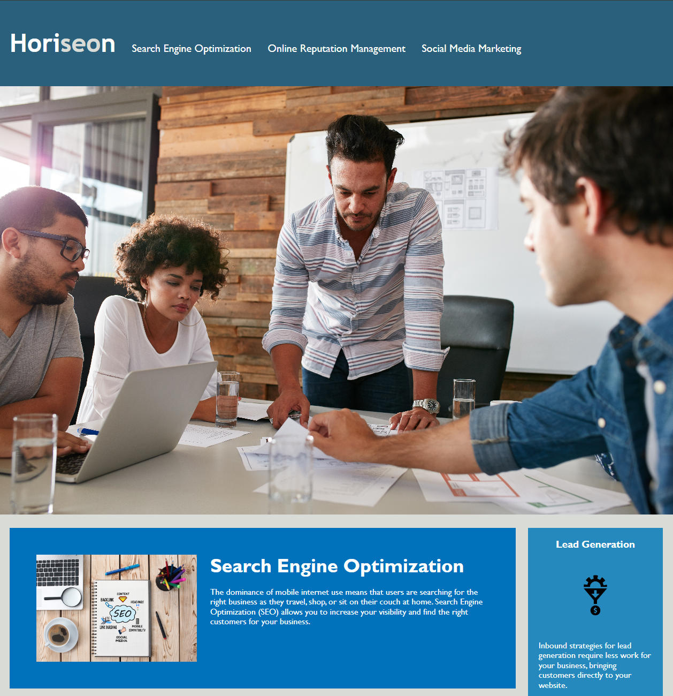
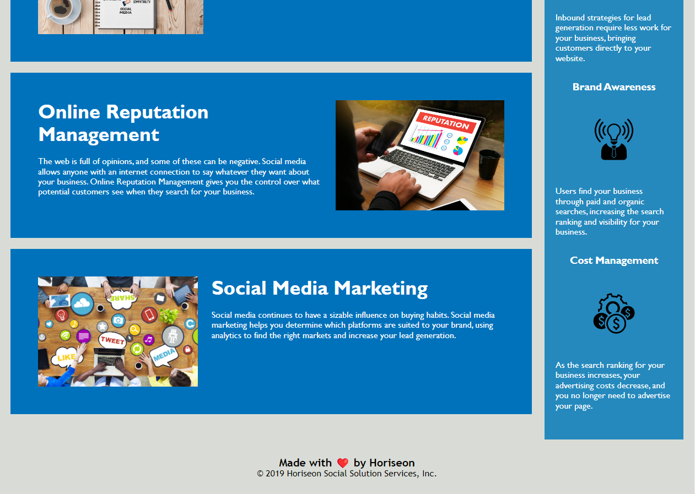

# Horiseon Webpage Refactor
 This webpage is a sample of what a Horiseon Management page could look like. It discribes what services they offer and the advatages for the client that come with them. 

### Changes From 
* replaced non-semantic elements with proper semantic elements (header, nav, section, acticle, footer)
* added alt elements to images
* fixed nav links

## Credits
used normalize.css  from: https://necolas.github.io/normalize.css/ for .webpage/assets/reset.css 

used mdn for refrances: https://developer.mozilla.org/en-US/.